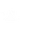
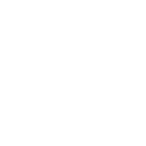
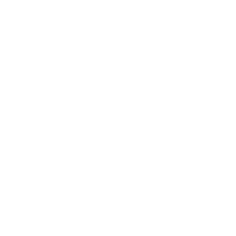
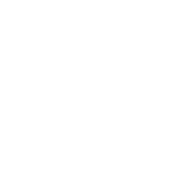

<!-- Replace YOUR-USERNAME and the bracketed text, then remove any sections that don't fit. -->

 

---

## 

> ## Welcome to Hysteria! 
*Where there is no chosen savior... only those willing to do what's necessary.*

 LinkedIn: [Yasin Kanlioglu](https://www.linkedin.com/in/yasin-kanlioglu-7a5569379) 
 Website: [N/A](n/a) 
 Indeed: [Yasin Kanlioglu](https://profile.indeed.com/?hl=en_GB&co=GB&from=gnav-homepage)

## 

 Learning: **[Java Spring]** 
 Exploring: **[Website Development]** 
 Leading: **[[Hysteria](https://discord.com/invite/path-to-hysteria)]**

*Thanks for stopping by — more as I learn and build.*

